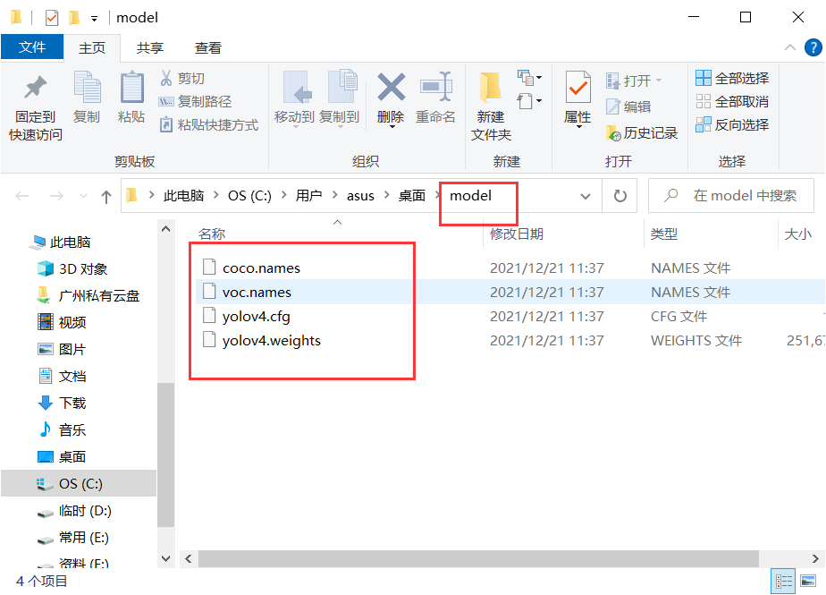
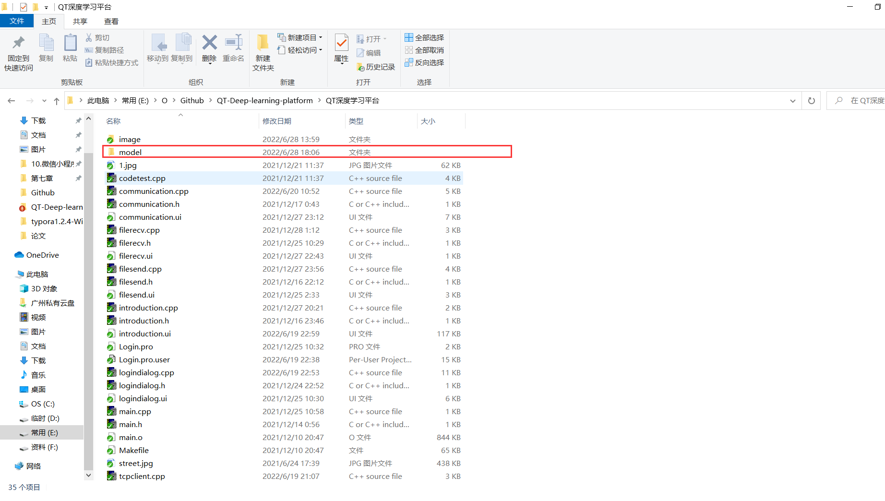

# QT-Deep-learning-platform
基于QT的深度学习平台，其中使用了opencv部署了yolov4算法
**(如果你使用git下载总是报红，你可以选择下载dev-sidecar编程软件加速下载--https://gitee.com/interesting-goods/dev-sidecar?_from=gitee_search)**
（如果您觉得有用，麻烦点个start）

#### 第一步、下载下面的model文件夹，放在“QT深度学习平台\”中，

链接：https://pan.baidu.com/s/1e-RHroxJNbKaew5jEqIT4w 提取码：mycz

#### 第二步、根据“ubuntu安装opencv.docx”文件，配置ubuntu的opencv环境
网址：https://blog.csdn.net/caip12999203000/article/details/125518281?spm=1001.2014.3001.5502

#### 第三步、ubuntu安装qt
推荐的链接：

（下载qt）https://blog.csdn.net/sonicss/article/details/121802956

（安装qt）https://blog.csdn.net/zdragond
